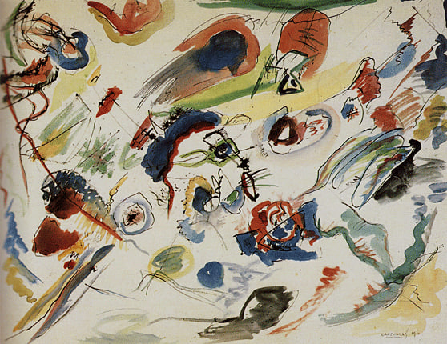

# Deep-Convolutional-Generative-Adversarial-Network (DCGAN)

## Dataset:
Abstract Art Gallery Dataset 
https://www.kaggle.com/datasets/bryanb/abstract-art-gallery

Sample image from dataset: 

## How to use:
1. Open the .py file
2. Update the path to the dataset
3. Run the code

## Results:
Results after 400 epochs: 

## Reference:
https://arxiv.org/pdf/1511.06434v2
